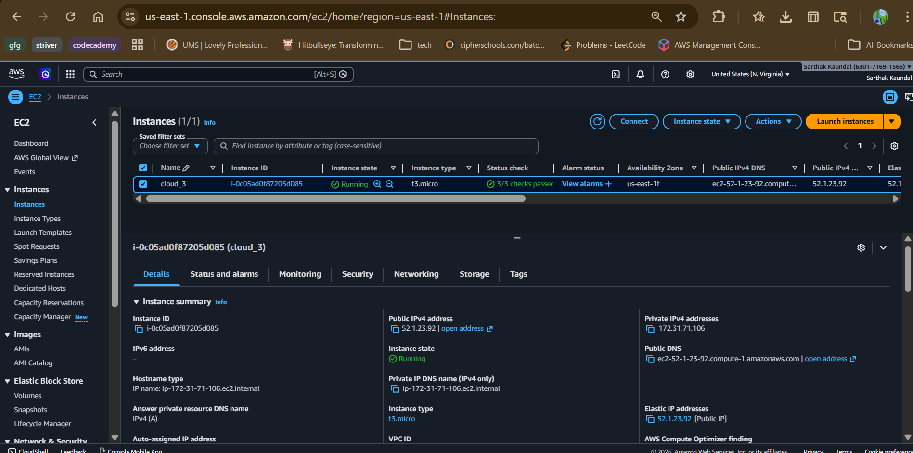
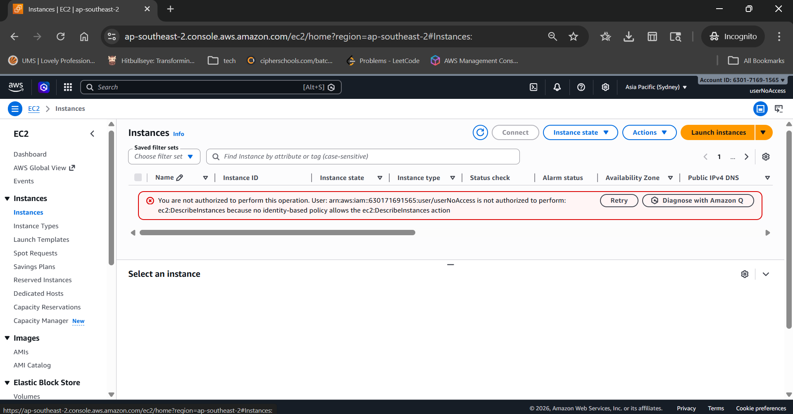
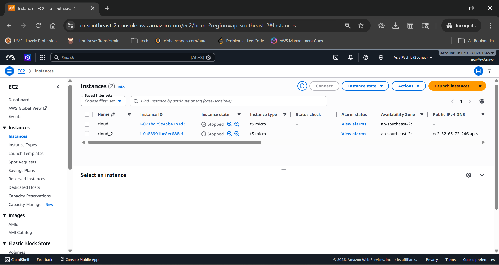

# AWS EC2 Static Website Hosting with IAM Access Control

---

## 🔗 Deployed Link

http://52.1.23.92

---

##  Project Overview

* Hosted a static website using AWS EC2
* Configured Apache web server
* Implemented IAM access control with two users:

  * User 1 → No permissions
  * User 2 → EC2 full access

---

##  Tech Stack

* AWS EC2 (Ubuntu)
* Apache2 Web Server
* HTML, CSS, JavaScript
* AWS IAM

---

##  Steps Performed

### 1. EC2 Setup

* Launched Ubuntu EC2 instance (t2.micro)
* Allowed HTTP (80) and SSH (22)
* Connected via SSH

### 2. Web Server Setup

* Installed Apache2
* Deployed static website files in `/var/www/html`

### 3. Elastic IP

* Allocated Elastic IP
* Associated it with EC2 instance
* Used Elastic IP for public access

### 4. IAM Configuration

* Created **User 1 (No Access)**

  * No policies attached
* Created **User 2 (EC2 Access)**

  * Attached `AmazonEC2FullAccess`
  * Attached `IAMUserChangePassword`

---

##  Screenshots

### 🔹 Static Website Output

### 🔹 SEC2 Instance Dashboard

### 🔹 User 1 Login (No Access)

### 🔹 User 2 Login (With Access)

(Add screenshot showing EC2 dashboard visible)

##  Challenges Faced

* SSH connection issues due to key permissions
* Confusion in IAM policy attachment
* Apache setup and file permissions

---

##  Conclusion

Successfully deployed a static website on AWS EC2 and implemented IAM-based access control using different permission levels.

